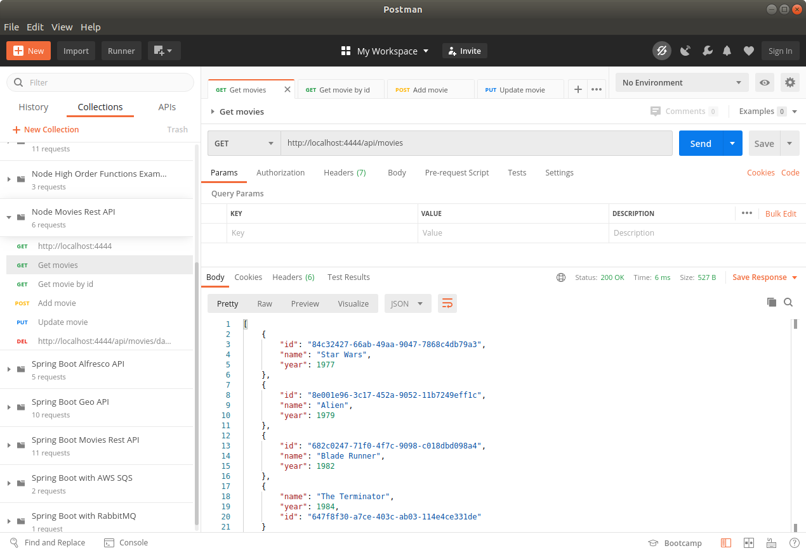
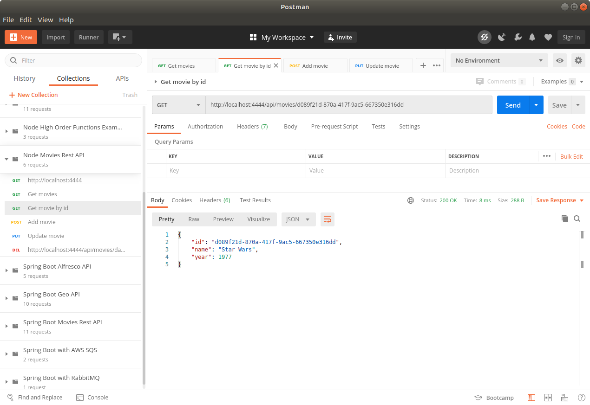
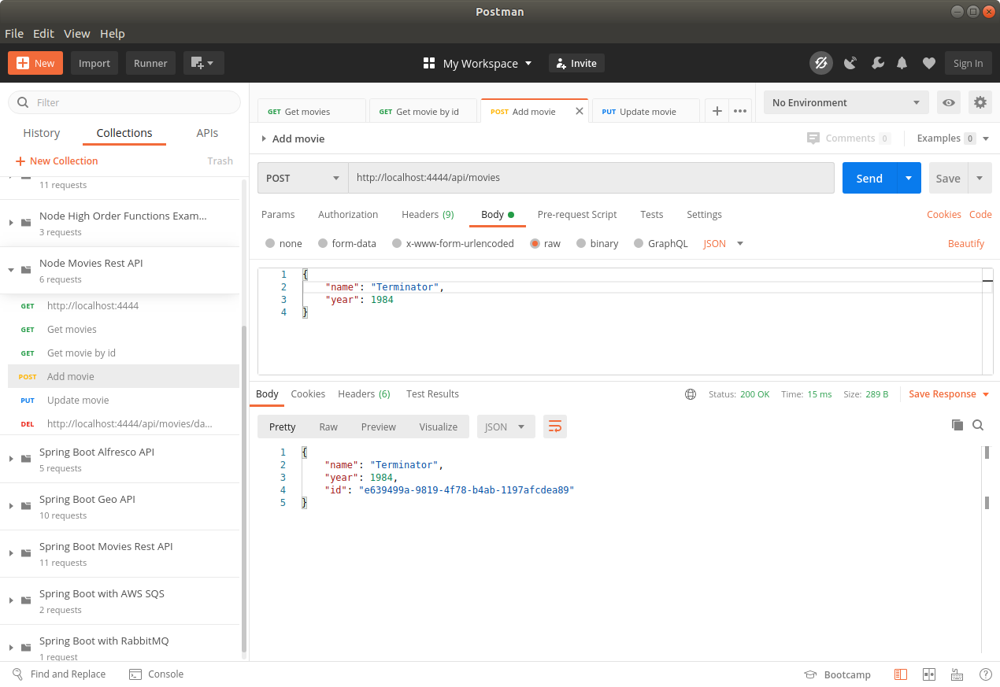
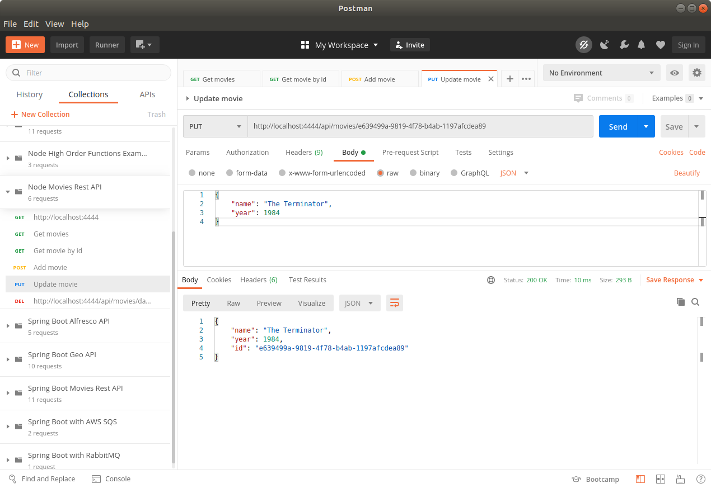
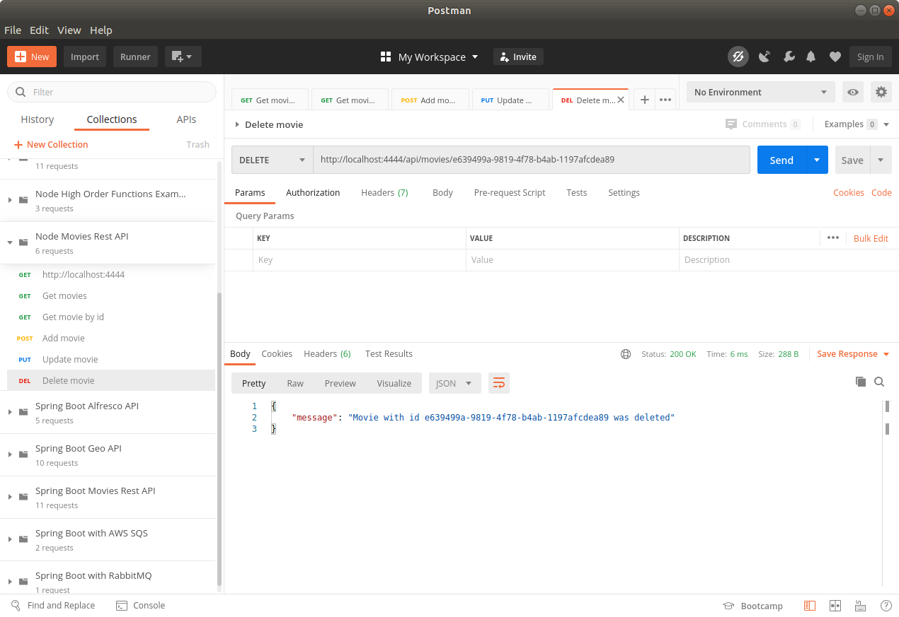

MOVIES REST API
-------------------------------------------------------------------------------

Sencilla API Rest desarrollada con Node y Express que se levanta
dentro de contenedor Docker.

-------------------------------------------------------------------------------

Se genera archivo Dockerfile que utiliza imagen Node Alpine:

```

    FROM node:alpine

    COPY ./src ./src
    COPY ./package.json .
    RUN npm install

    CMD ["npm", "start"] 
    EXPOSE 4444

```

-------------------------------------------------------------------------------

Se construye imagen a partir de archivo Dockerfile y se levanta 
contenedor a partir de la imagen generada:


```

    docker build -t node-docker-app .

    docker run -d --net=host node-docker-app

```

-------------------------------------------------------------------------------

**Ejecucion de endpoint que recupera movies en Postman:**



-------------------------------------------------------------------------------

**Ejecucion de endpoint que recupera movie by id en Postman:**



-------------------------------------------------------------------------------

**Ejecucion de endpoint que agrega movie en Postman:**



-------------------------------------------------------------------------------

**Ejecucion de endpoint que actualiza movie en Postman:**



-------------------------------------------------------------------------------

**Ejecucion de endpoint que elimina movie en Postman:**



-------------------------------------------------------------------------------